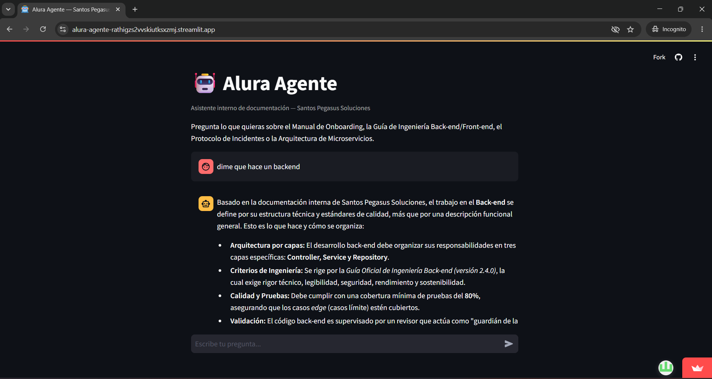

# 🤖 Alura Agente — Santos Pegasus Soluciones

Agente de inteligencia artificial (RAG — *Retrieval-Augmented Generation*) capaz
de responder preguntas en lenguaje natural sobre la documentación interna de
**Santos Pegasus Soluciones**, empresa de tecnología especializada en
microservicios y soluciones de IA.

Proyecto final del **Challenge Alura Agente** (curso de Cloud Computing – Alura).

🔗 Aplicación funcionando: https://alura-agente-rathigzs2vvskiutksxzmj.streamlit.app/



---

## 📚 Base de conocimiento

El agente responde preguntas basándose en los siguientes documentos internos
(colocados en `/data`):

- `Manual de Onboarding para Nuevos Desarrolladores.pdf`
- `Guía Oficial de Ingeniería Back-end.pdf`
- `Guía Oficial de Ingeniería Front-end.pdf`
- `Protocolo de Respuesta a Incidentes y Post-Mortems.pdf`
- `Arquitectura de Microservicios y Mapa de Dominios.pdf`

---

## 🏗️ Arquitectura

```
┌─────────────┐      ┌──────────────┐      ┌───────────────────┐
│  Documentos  │ ---> │   Ingesta    │ ---> │   Índice vectorial │
│  PDF (data/) │      │ (ingest.py)  │      │  FAISS (local)     │
└─────────────┘      └──────────────┘      └────────┬───────────┘
                                                       │
                                                       ▼
┌──────────────┐     ┌────────────────────┐   ┌────────────────┐
│   Usuario     │---> │  Interfaz Streamlit │-->│  Retriever      │
│ (pregunta)    │     │      (app.py)       │   │  (busca chunks  │
└──────────────┘     └────────┬────────────┘   │  relevantes)    │
                               │                └────────┬────────┘
                               ▼                          ▼
                     ┌────────────────────────────────────────┐
                     │   LLM Gemini (2.5 Flash) — agent.py   │
                     │   Genera la respuesta usando solo el     │
                     │   contexto recuperado                    │
                     └────────────────────────────────────────┘
```

**Componentes:**

| Capa | Tecnología | Motivo |
|---|---|---|
| Lectura de documentos | `PyPDFLoader` (LangChain) | Extrae texto de los PDF |
| Fragmentación | `RecursiveCharacterTextSplitter` | Divide en chunks de 1000 caracteres con solapamiento |
| Embeddings | `sentence-transformers/all-MiniLM-L6-v2` (HuggingFace, local) | 100% gratis, corre en CPU, sin API key |
| Base vectorial | FAISS | Búsqueda por similitud, corre en local, gratis |
| LLM (generación de respuesta) | Google Gemini — `gemini-2.5-flash` | Gratis, sin tarjeta de crédito, buen contexto (1M tokens) |
| Orquestación | LangChain (`create_retrieval_chain`) | Une retriever + LLM |
| Interfaz | Streamlit | Simple de correr y de exponer en un servidor |
| Hosting | Streamlit Community Cloud (ver [`DEPLOY.md`](./DEPLOY.md) para alternativas: Hugging Face Spaces, OCI) | Accesibilidad pública requerida por el challenge |

**Flujo (pipeline RAG):**
1. `ingest.py` lee los PDF, los trocea y genera un embedding (vector numérico) por
   fragmento, guardando todo en un índice FAISS local.
2. Cuando el usuario pregunta algo, `agent.py` convierte la pregunta en un vector,
   busca los 4 fragmentos más parecidos en el índice (`retriever`) y se los pasa
   al LLM de Gemini junto con la pregunta.
3. El LLM responde **solo** con base en esos fragmentos (no inventa información
   que no esté en los documentos).

---

## 💬 Ejemplos de preguntas y respuestas

Tú: Del Manual de Onboarding: "¿Qué debe hacer un nuevo desarrollador en su primera semana?"

Agente: De acuerdo con el **Manual de Onboarding para Nuevos Desarrolladores**, durante la primera semana un nuevo integrante debe enfocarse en lo siguiente:

*   **Objetivo principal:** El objetivo de la primera semana es tener el entorno configurado y conocer al equipo. No se espera que el desarrollador sea plenamente productivo en este periodo (Sección 1.1).
*   **Checklist de Accesos y Cuentas (Sección 12.1):**
    *   Asegurarse de que el correo corporativo (`@santopegasus.com`) esté funcionando.
    *   Instalar Slack y unirse a los canales obligatorios.
    *   Confirmar el acceso a la organización privada en GitHub.
*   **Documentación y Seguimiento (Sección 12):**
    *   Completar el checklist de la Semana 1 conjuntamente con su Tech Lead.
    *   Guardar dicho checklist en su página personal de onboarding dentro de Confluence.
(Fuente(s): Manual de Onboarding para Nuevos Desarrolladores — Santo Pegasus Soluciones.pdf)

Tú: De la Guía Back-end: "¿Qué estándares técnicos se exigen en el back-end?"

Agente: Basado en la **Guía Oficial de Ingeniería Back-end** (mencionada en el contexto proporcionado), los estándares técnicos que se exigen son los siguientes:

*   **Arquitectura:** Las responsabilidades deben estar correctamente divididas en las capas de **Controller, Service y Repository**.
*   **Pruebas:** Se exige una **cobertura mínima del 80%** y que los casos de borde (*edge cases*) estén cubiertos.
*   **Criterios de Revisión:** Todo código debe ser validado minuciosamente en cuanto a su **legibilidad, seguridad y rendimiento**.
*   **Filosofía de Ingeniería:** El desarrollo debe regirse por el rigor técnico, la sostenibilidad y el cumplimiento riguroso de las directrices establecidas en la guía.

Esta información proviene de la sección de "Conformidad" y de la cita a la página 8 de la *Guía Oficial de Ingeniería Back-end.pdf*.
(Fuente(s): Guía Oficial de Ingeniería Front-end — Santo Pegasus Soluciones.pdf, Manual de Onboarding para Nuevos Desarrolladores — Santo Pegasus Soluciones.pdf)

Tú: Del Protocolo de Incidentes: "¿Cuáles son los pasos ante un incidente?"

Agente: Basado en la documentación interna de Santos Pegasus Soluciones, los pasos ante un incidente se dividen en las siguientes fases:

### 1. Confirmación (Fase 1)
Antes de la declaración formal, se debe confirmar el incidente:
*   **Si se confirma:** Proceder a la Fase 2.
*   **Si es un falso positivo:** Documentar en el canal `#incidents` y cerrar la alerta.

### 2. Declaración del Incidente (Fase 2: T+0 a T+5 minutos)
El responsable es el **Engineer On-Call** y el **Incident Commander (IC)**. Los pasos son:
*   El **Engineer on-call** publica un mensaje inicial en el canal `#incidents`.
*   El **IC de turno** recibe la notificación, asume el comando y declara formalmente el incidente con una severidad inicial.
*   El **IC** crea el canal de **War Room** (`#sev1-war-room` o `#sev2-war-room`).
*   El **IC** asigna los roles: *Communications Lead*, *Technical Lead* y *SMEs* necesarios.
*   El **IC** abre el documento de **timeline** (Google Doc o Confluence) y comparte el link en la War Room.
*   El **IC** publica la declaración formal en el canal de la War Room.

### 3. War Room y Diagnóstico (Fase 3: T+5 en adelante)
El responsable es el **Technical Lead** junto con los **SMEs**, quienes se encargan de la resolución y diagnóstico del problema.

### 4. Proceso de Revisión (Post-Mortem)
Una vez resuelto el incidente, se sigue este proceso de aprendizaje:
*   **Paso 1 — Borrador Inicial:** El Technical Lead redacta el Post-Mortem con el timeline y el análisis de causa raíz (5 Whys).
*   **Paso 2 — Revisión Técnica:** Se comparte con los participantes (IC, Communications Lead, SMEs) para validar los hechos.
*   **Paso 3 — Revisión del Chapter Lead SRE:** El Chapter Lead de SRE valida que la causa raíz esté correctamente identificada.

**Fuente:** *Secciones 6.3 (Fase 2), 6.4 (Fase 3) y 11.2 (Proceso de Revisión) del Protocolo de Incidentes.*
(Fuente(s): Protocolo de Respuesta a Incidentes y Post-Mortems — Santo Pegasus Soluciones.pdf)

Tú: De Arquitectura de Microservicios: "¿Cómo está organizado el mapa de dominios?"

Agente: Basado en el documento **Arquitectura de Microservicios y Mapa de Dominios**, la organización del mapa de dominios se define de la siguiente manera:

*   **Organización por Squads:** Los equipos están organizados por **dominio de negocio**. Cada *squad* tiene la responsabilidad total (*ownership* completo) sobre el ciclo de vida del software de su dominio, desde el código hasta el despliegue en producción.
*   **Dominios Principales:** El producto principal, Agendio, organiza su dominio en torno a la conexión de tres actores clave: **pacientes, médicos y clínicas**.
*   **Servicios Específicos:** Se menciona explícitamente el dominio de agendamiento, gestionado por el microservicio `agendio-scheduling-service`.
*   **Estructura Documental:** El mapa detallado se encuentra estructurado en el documento a través de dos secciones clave (aunque el detalle de cada una no está totalmente desarrollado en el fragmento):
    *   **Sección 3:** Catálogo Completo de Microservicios.
    *   **Sección 4:** Mapa de Dependencias entre Servicios.

En resumen, la organización es **dominio-céntrica**, permitiendo que cada área de negocio funcione con autonomía técnica y operativa.
(Fuente(s): Arquitectura de Microservicios y Mapa de Dominios — Santo Pegasus Soluciones.pdf, Guía Oficial de Ingeniería Front-end — Santo Pegasus Soluciones.pdf)
---

## ⚙️ Instrucciones para ejecutar el proyecto (local)

### Requisitos
- Python 3.10+
- Una API key gratuita de Google AI Studio: https://aistudio.google.com/apikey

### Pasos (Windows / PowerShell)

```powershell
# 1. Clonar el repositorio
git clone https://github.com/TU_USUARIO/alura-agente.git
cd alura-agente

# 2. Crear y activar entorno virtual
python -m venv venv
venv\Scripts\activate

# 3. Instalar dependencias
pip install -r requirements.txt

# 4. Configurar la API key
copy .env.example .env
# Abre .env y pega tu GOOGLE_API_KEY

# 5. Colocar tus documentos PDF/CSV dentro de la carpeta data/

# 6. Generar el índice vectorial (solo una vez, o cuando cambien los documentos)
python src/ingest.py

# 7a. Probar en consola
python src/agent.py

# 7b. O correr la interfaz web local
streamlit run src/app.py
```

---

## ☁️ Deploy

**🔗 Aplicación funcionando:** `https://alura-agente-rathigzs2vvskiutksxzmj.streamlit.app/`

Se desplegó en **[Streamlit Community Cloud / Hugging Face Spaces / OCI — deja solo la que usaste]**.
Pasos completos de despliegue (incluye las tres opciones) en [`DEPLOY.md`](./DEPLOY.md).

---

## 📂 Estructura del repositorio

```
alura-agente/
├── data/                 # Documentos PDF/CSV (base de conocimiento)
├── src/
│   ├── ingest.py         # Construye el índice vectorial
│   ├── agent.py          # Lógica del agente RAG (consola)
│   └── app.py            # Interfaz web (Streamlit)
├── faiss_index/          # Índice generado (no se sube a git)
├── requirements.txt
├── .env.example
├── .gitignore
├── DEPLOY.md             # Guía de despliegue (Streamlit Cloud / HF Spaces / OCI)
└── README.md
```

---

## 🧠 Decisiones técnicas

- **Embeddings locales en vez de API paga:** se usa un modelo open-source de
  HuggingFace que corre en CPU, evitando costos y límites de cuota solo para
  generar los vectores del índice.
- **Gemini como LLM:** Google AI Studio ofrece un tier gratuito sin tarjeta de
  crédito, con una ventana de contexto de hasta 1 millón de tokens, suficiente
  para una demo funcional del challenge.
- **FAISS local:** no requiere una base de datos vectorial externa ni
  credenciales adicionales, lo que simplifica el despliegue en cualquier
  proveedor de nube — el índice se genera una vez y se sube junto con el
  código.
- **Hosting flexible:** el proyecto corre igual en Streamlit Community Cloud,
  Hugging Face Spaces u OCI, ya que no depende de ningún servicio propietario
  de un proveedor específico. Ver [`DEPLOY.md`](./DEPLOY.md) para el paso a
  paso de cada opción.
